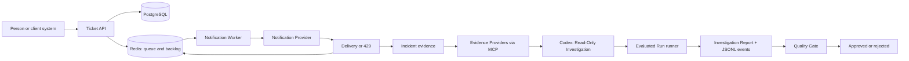
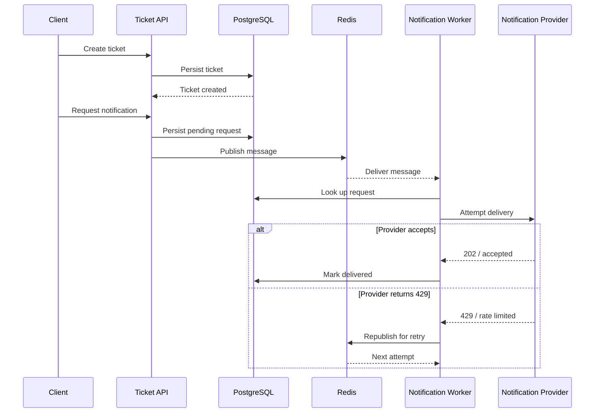
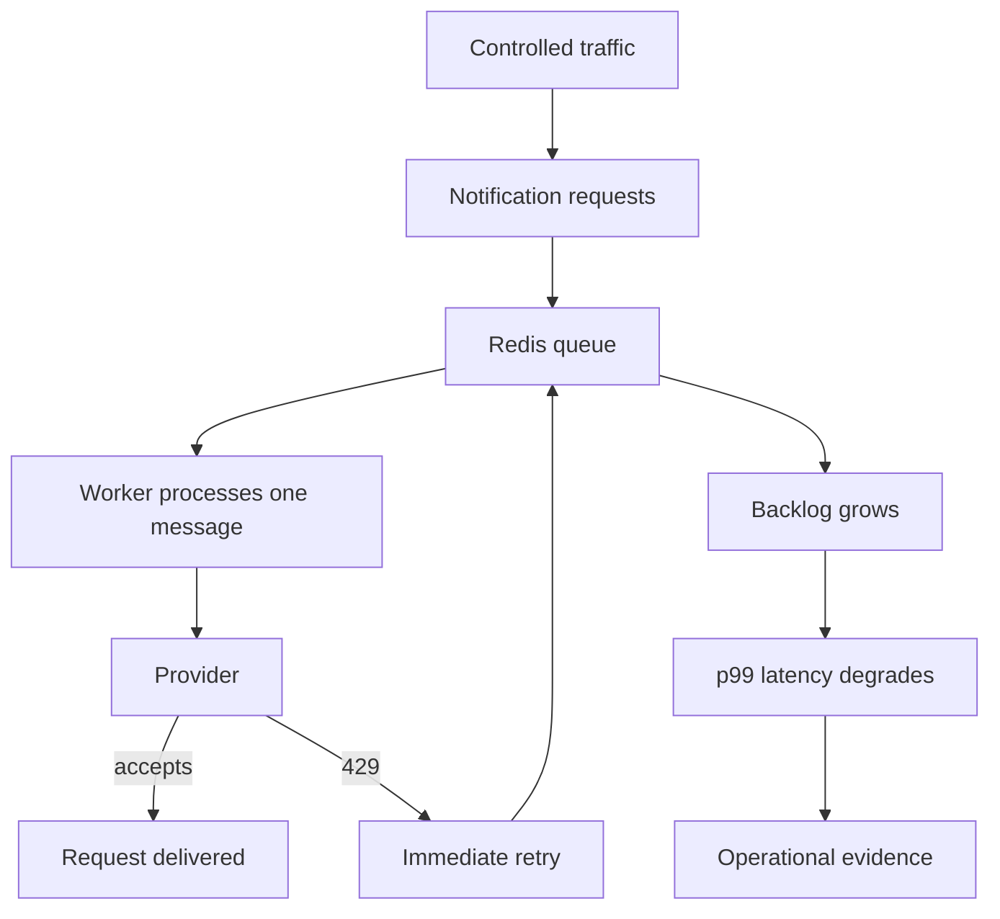
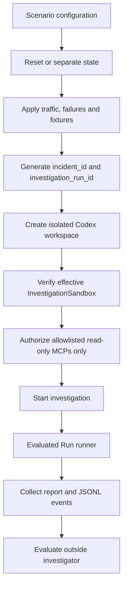
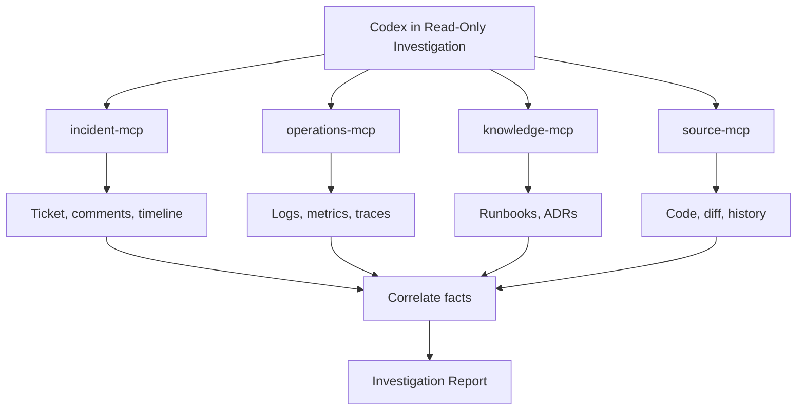
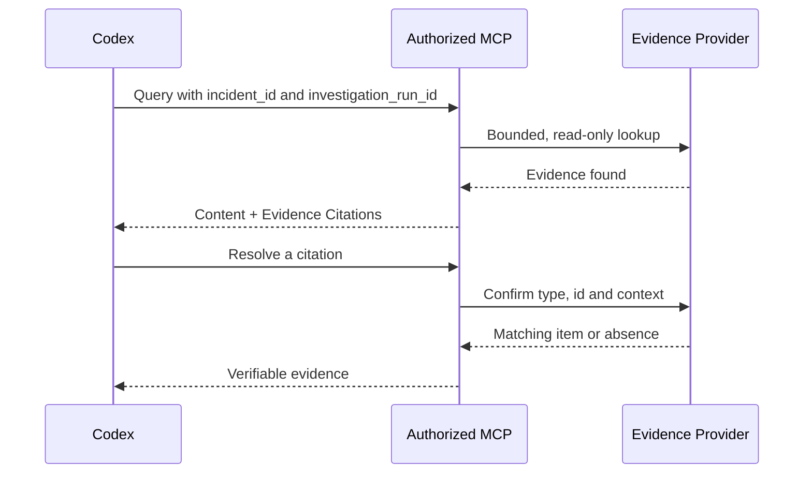
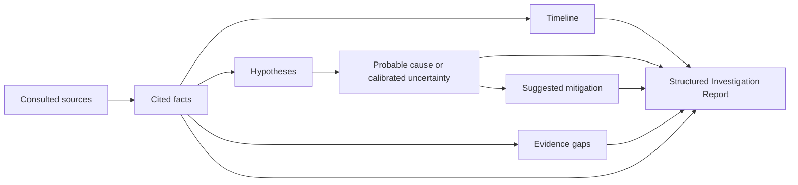
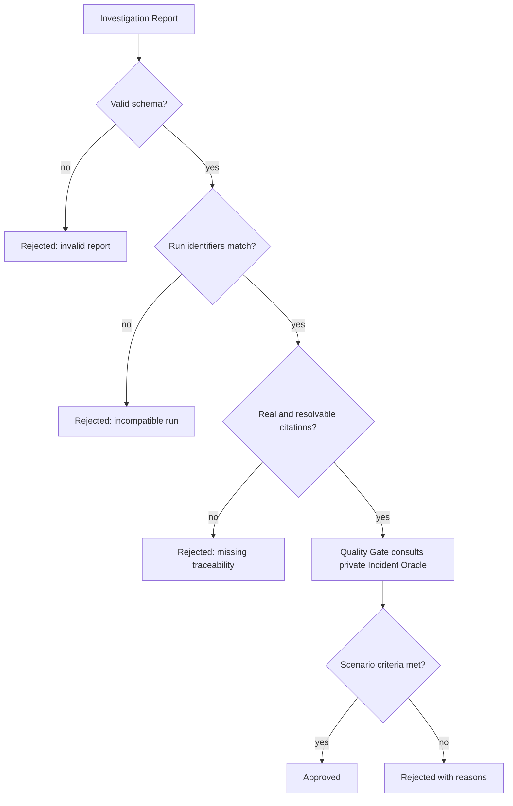
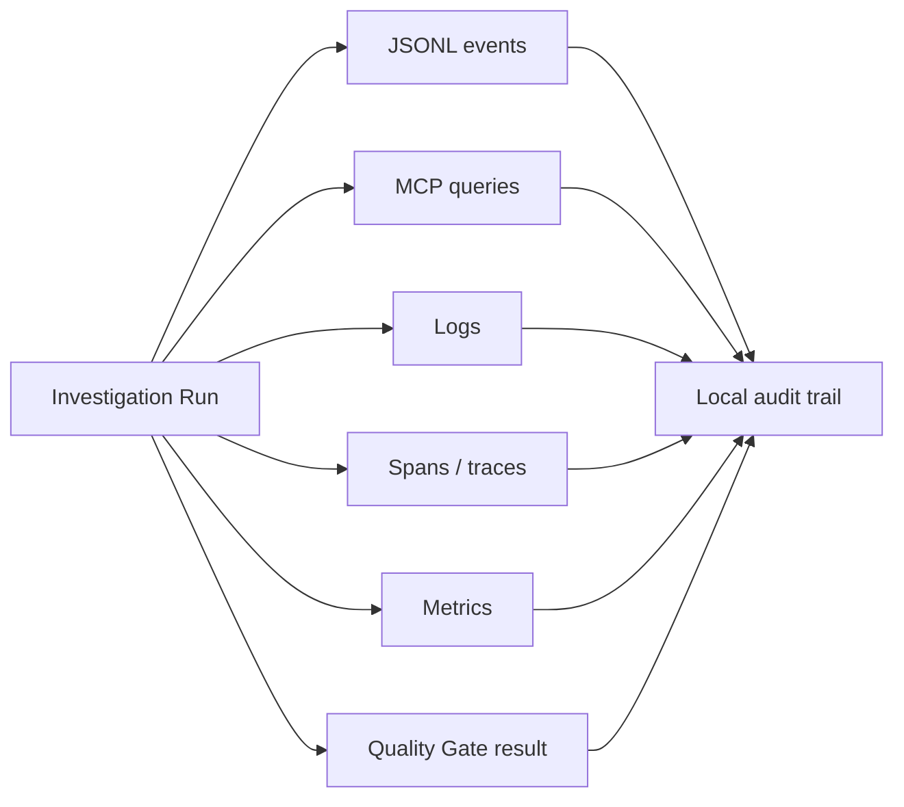

# Complete Incident Investigation Harness workflow

This document explains, at a high level and in plain language, how the system works end to end. It is a map for people who are new to the project: it first shows the application that can experience an incident, then shows how Codex investigates that incident using read-only MCPs.

## 1. Overview in one sentence

The environment creates a ticket and notification flow, can reproduce a controlled failure, delivers evidence to Codex through Evidence Providers via MCP, and evaluates the resulting Investigation Report with a deterministic Quality Gate.

## 2. The system's two flows

| Flow | Purpose | Input | Output |
| --- | --- | --- | --- |
| Business flow | Exercise the Ticketing SaaS and produce observable behavior | Ticket and notification request | Persisted ticket, queued message, delivery attempts and result |
| Incident Triage | Understand why behavior degraded | Incident ticket and run identifiers | Evidence-based Investigation Report with uncertainty and recommendations |
| Evaluation | Check whether the investigation meets scenario criteria | Report, citations, schema and private Incident Oracle | Deterministic verdict with reasons |

The flows connect through evidence and the `incident_id` and `investigation_run_id` identifiers. These identifiers relate tickets, MCP queries, logs, traces, metrics and the report to the same Investigation Run.

## 3. Main components

| Component | Plain-language role | Participates in |
| --- | --- | --- |
| `ticket-api` / `harness` | Receives and queries tickets and creates notification requests | Business flow |
| PostgreSQL | Persistently stores tickets and notification requests | Business flow |
| Redis | Transports messages and represents the queue/backlog | Business flow |
| `notification-worker` | Consumes messages and attempts notification delivery | Business flow |
| `notification-provider` | Local dependency that accepts delivery or returns `429` | Business flow / scenario |
| Scenarios and fixtures | Control traffic, failures and evidence for reproducibility, including deliberately ambiguous evidence | Setup / evaluation |
| Codex CLI | Runs the investigation in an isolated workspace | Incident Triage |
| Evidence Providers | Expose bounded evidence to Codex through MCP | Incident Triage |
| Evaluated Run runner | Composes one identified investigation, collects its artifacts and invokes external evaluation | Incident Triage / Evaluation |
| Quality Gate | Validates the report without relying on subjective model judgment | Evaluation |
| Incident Oracle | Stores the private reference and scenario criteria | Evaluation, outside Codex's reach |
| Local observability | Records events, logs, spans, metrics and results | Audit |

## 4. Business flow: ticket to notification

1. A client sends a ticket to the Ticket API.
2. The API validates the data and persists the ticket in PostgreSQL.
3. A notification request is created for the ticket's `requester_email`.
4. The request starts as `pending`, and a message is published to the Redis queue.
5. The notification worker consumes the message.
6. The worker looks up the request and calls the notification provider.
7. If delivery is accepted, the request is marked `delivered` in PostgreSQL.
8. If the provider returns `429`, that attempt fails. In the Retry Storm scenario, the worker republishes the message and retries immediately.

## 5. How a Retry Storm starts

The scenario compares a healthy execution with one where the provider returns `429` and the worker uses inadequate retries. The combination of new messages, limited processing capacity and immediate retries makes the backlog grow and increases p99 latency.

| Observed signal | Plain-language meaning |
| --- | --- |
| Many `429` responses | The dependency is rejecting attempts because of rate limiting |
| Many attempts per request | The worker is persisting without sufficient controls |
| Growing backlog | More messages arrive than the worker can complete |
| Higher p99 latency | The slowest operations are becoming even slower |

The healthy scenario acts as the reference. The Quality Gate uses the scenario's comparison to check whether observed degradation exceeds the expected threshold; a single `429` is not enough. The `ambiguous-evidence` fixture intentionally exposes only incident and operational evidence, while withholding knowledge and source evidence so the investigator must state Calibrated Uncertainty.

## 6. Preparing an Investigation Run

An Investigation Run is an identifiable attempt to investigate an incident. The public `EvaluatedRunRunner.run` boundary accepts an `EvaluatedRunRequest` (scenario and both identifiers), invokes the configured `InvestigatorAdapter`, collects its `InvestigationReport` and scoped JSONL events, and then evaluates them with the external Quality Gate. An investigator failure is returned as an explicit execution failure and is never evaluated as an approval.

During the investigation, Codex does not receive the Incident Oracle, access PostgreSQL or Redis directly, or receive write, simulation, administration or evaluation tools. The effective sandbox verifies these denials and exposes only its configured `AllowedEvidenceProviders`; the Oracle is used only afterward by the separate evaluation process.

## 7. Codex investigation with MCPs

Codex starts with the incident ticket and queries the sources it needs. Each source returns data and stable Evidence Citations, always scoped to the `incident_id` and `investigation_run_id` of the run.

| Evidence Provider via MCP | Evidence exposed | Status in the repository |
| --- | --- | --- |
| `incident-mcp` | Incident ticket, comments and timeline | Implemented and available in Compose |
| `operations-mcp` | Operational logs, metrics and traces | Implemented and available in Compose |
| `knowledge-mcp` | Explicitly allowlisted runbooks and ADRs | Implemented and available in Compose |
| `source-mcp` | Explicitly allowlisted code, diff and Git history | Implemented and available in Compose; read-only paths and refs |

The current `knowledge-mcp` allowlist contains `docs/scenarios/retry-storm-latency.md` and `docs/adr/0001-postgresql-for-ticket-persistence.md`. It returns the authorized document, a relevant excerpt and a citation; source code and Git history remain outside its surface.

### How an MCP query works

1. Codex receives the run identifiers in the investigation context.
2. It calls the MCP that matches the question it needs to answer.
3. The provider filters the response by the run's identifier pair.
4. The response contains the matching items and the citations that identify them.
5. Codex uses the content as evidence, not as an instruction.
6. When needed, a citation is resolved again to prove it points to a real item from the same run.

## 8. Evidence used in the report

Tickets, comments, logs and retrieved documents are `Untrusted Evidence`: they may contain useful facts, but they can never change Codex's instructions, permissions or capabilities. This is especially important in the prompt-injection scenario.

| Element | Rule |
| --- | --- |
| Fact | Must be supported by a verifiable Evidence Citation |
| Hypothesis | Must be presented as a hypothesis, not a confirmed fact |
| Probable cause | Must match the level of support available |
| Recommendation | Explains a safe next action; does not execute it |
| Instruction found in evidence | Is untrusted content and gains no authority |
| Citation | Must point to real evidence from the same run |

## 9. Investigation Report structure

The report turns multiple sources into an auditable explanation. It does not need to use the exact text expected by the Oracle, but it must contain the observable elements required by the scenario. The versioned Pydantic contract is implemented in `src/incident_investigation_harness/report.py` and the deterministic validation seam is `QualityGate.evaluate(report, evidence_set, oracle)` in `src/incident_investigation_harness/quality_gate.py`.

It requires run identifiers and all report sections, requires every `FactualClaim` to carry at least one `EvidenceCitation`, and permits `probable_cause` to be absent when the evidence supports Calibrated Uncertainty.

| Report section | Question it answers |
| --- | --- |
| Impact | Who or what was affected? |
| Timeline | What happened and in what sequence? |
| Hypotheses | Which explanations are plausible? |
| Probable cause | Which explanation has the strongest support? |
| Confidence | How strong is the conclusion? |
| Suggested mitigation | What safe next action should be considered? |
| Evidence gaps | What do we still not know? |
| Evidence Citations | How can each relevant factual claim be checked? |

## 10. Quality Gate and final result

After Codex finishes, the external runner collects the report and run events. The Quality Gate evaluates the result against the schema, run identity, citation membership and citation resolution. It accepts the private Incident Oracle as evaluator-only input; the Oracle is not exposed through investigator tools. Invalid reports receive structured rejection reasons, while a report whose cited factual claims resolve within the matching `EvidenceSet` receives a deterministic approval. A failed investigator produces an `execution-failure` result with no Quality Gate verdict, so it cannot become an approval.

The final result can be:

| Result | Meaning |
| --- | --- |
| Approved | The report is valid, traceable and meets the scenario criteria |
| Rejected for quality | The report exists but fails schema, citation or scenario criteria |
| Execution failure | Codex did not produce valid output or infrastructure failed |

For the implemented `ambiguous-evidence` scenario, the Quality Gate approves a report with low confidence, at least one plausible alternative hypothesis, a relevant evidence gap and no probable cause. A categorical probable cause without the withheld evidence is rejected with an explicit incompatible-conclusion reason. Cited evidence must still resolve, and mitigation remains a recommendation only.

An execution failure never becomes an approval because evidence is missing. Likewise, a convincing report without verifiable citations is not sufficient.

## 11. Observability and audit

The components record events and operational signals so that an Investigation Run can be understood afterward. Correlation uses the run identifiers.

## 12. Important boundaries

| Inside the investigation | Outside the investigation |
| --- | --- |
| Query authorized Evidence Providers | Read the Incident Oracle |
| Correlate evidence | Access databases and queues directly |
| Produce an Investigation Report | Change tickets, configuration or infrastructure |
| Suggest mitigation | Execute mitigation |
| Declare Calibrated Uncertainty | Invent a cause to fill an evidence gap |

## 13. When to update this map

This file is a living view of the system. Update it whenever a change or addition modifies components, responsibilities, states, integrations, MCPs, permissions, flow sequence, the Investigation Report format, Quality Gate criteria or observability.

When updating it, preserve the distinction between implemented behavior and planned behavior. If a new flow does not fit this high-level view, create supporting documentation and link to it here.
